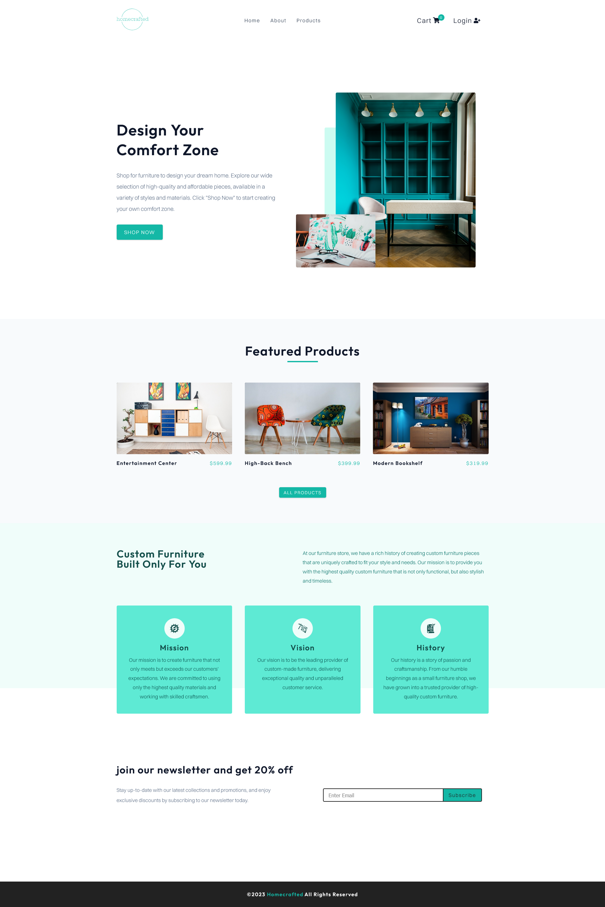

# homecrafted

## Built with

- React.js
- Netlify Serverless Functions
- External API
- Stripe
- Axios
- CSS
- dotenv
- React Icons
- React Router 6
- styled-components
- Global Context
- React Hooks (useState, useEffect, useReducer, useContext)
- Local Storage

## Users should be able to:

- Browse and explore a wide range of furniture products available in the store.
- Access the home page to find general information about the store and view featured products.
- Navigate to the About page to learn more about the store and its background.
- Visit the Products page to search for furniture items and apply filters based on name, category, company, color, price, and free shipping.
- Clear all applied filters to reset the product listing.
- Add desired products to their cart for future purchase.
- Click on a specific product to view detailed information such as reviews, price, and additional details.
- Navigate to the Cart page to review the products they have added and proceed with the checkout process.
- Log in to their accounts to access personalized features and information.
- Access the Checkout page, where they can provide mock card details to simulate the payment process.

## Links

- Live Site URL: [homecrafted](https://homecrafted.netlify.app/)
